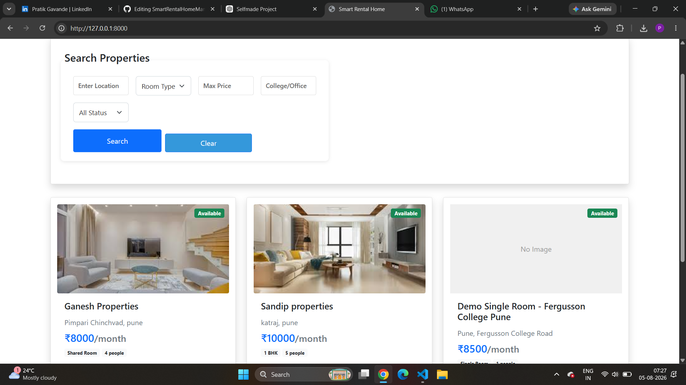
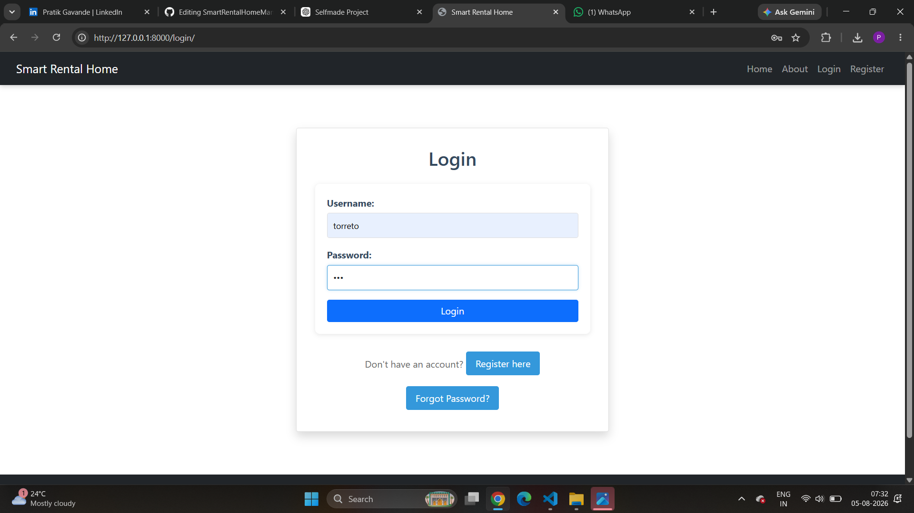
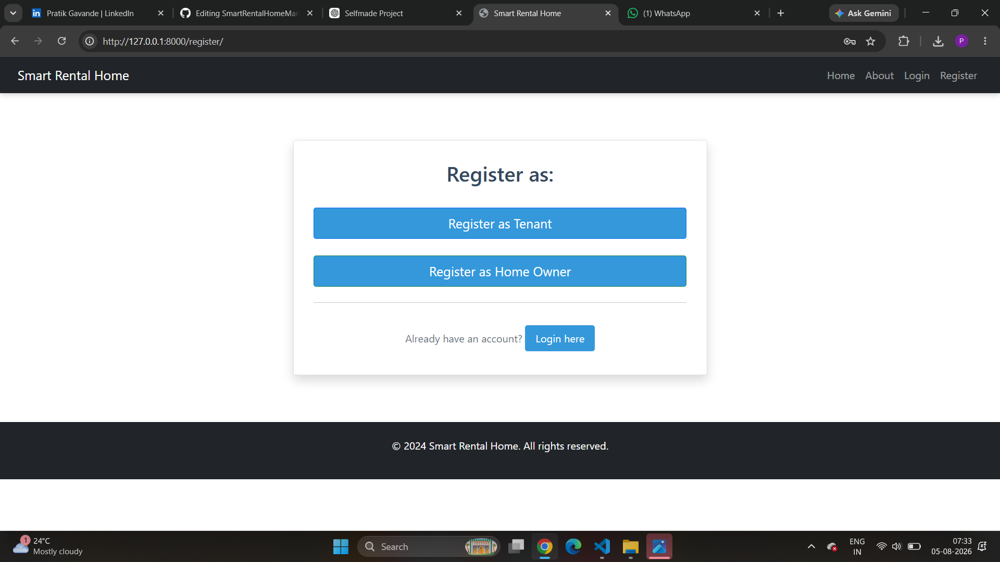
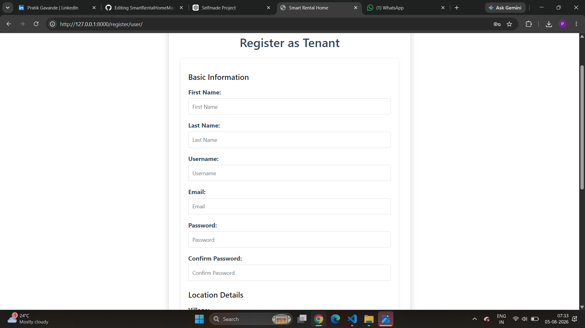
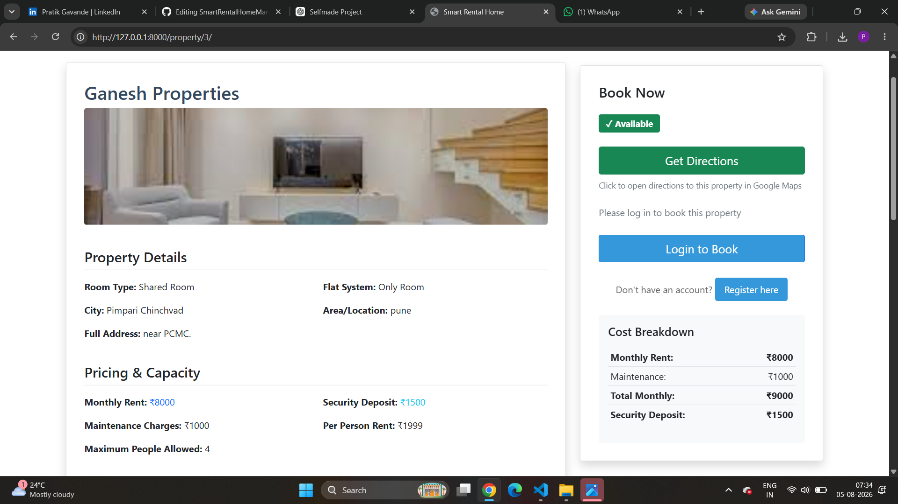
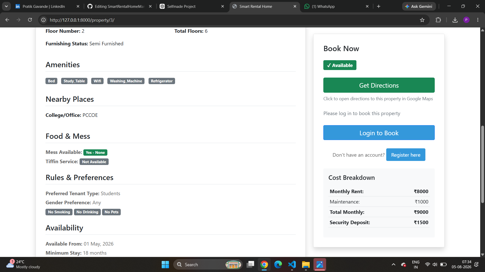
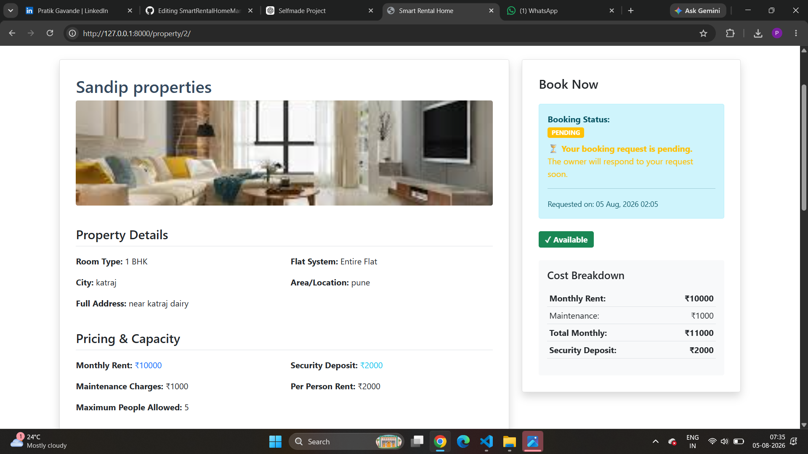

# 🏠 Smart Rental Home Management System

A **Django-based web application** designed to simplify the rental process by connecting **homeowners** and **tenants** on a single platform. The system enables homeowners to manage rental properties while allowing tenants to search, view, and send booking requests efficiently.

---

## 📌 Project Overview

The **Smart Rental Home Management System** is developed to make property rental management simple and organized. It provides a user-friendly interface for managing rental properties, booking requests, and user accounts.

The application supports role-based access for homeowners and tenants, secure authentication, property image uploads, advanced search, and booking management.

---

## ✨ Features

### 👤 User Management
- User Registration
- Secure Login & Logout
- Password Reset
- Role-based Authentication (Homeowner & Tenant)

### 🏠 Property Management
- Add New Property
- Update Property Details
- Delete Property
- Upload Property Images
- View Property Information

### 🔍 Property Search
- Search Rental Properties
- Filter by City
- Filter by Room Type
- Filter by Rent
- View Detailed Property Information

### 📅 Booking Management
- Send Booking Requests
- Manage Booking Requests
- Homeowner Booking Approval Workflow

### 🎨 User Interface
- Responsive Design
- Easy Navigation
- Clean Dashboard
- Property Image Gallery

---

# 🛠️ Tech Stack

| Technology | Purpose |
|------------|---------|
| Python | Programming Language |
| Django | Backend Framework |
| SQLite | Database |
| HTML5 | Frontend |
| CSS3 | Styling |
| Bootstrap | Responsive UI |
| JavaScript | Client-side Functionality |

---

# 📂 Project Structure

```text
SmartRentalHomeManagementSystem
│
├── manage.py
├── myproject/
├── myapp/
│   ├── migrations/
│   ├── templates/
│   ├── static/
│   ├── models.py
│   ├── views.py
│   ├── urls.py
│   ├── forms.py
│   ├── admin.py
│   └── apps.py
│
├── media/
├── staticfiles/
├── room_images/
└── README.md
```

---

# 👥 User Roles

## 🏠 Homeowner

- Register & Login
- Add Rental Properties
- Edit Property Details
- Delete Properties
- Upload Property Images
- View Booking Requests

### 👤 Tenant

- Register & Login
- Search Properties
- Filter Properties
- View Property Details
- Send Booking Requests

---

# 🔄 System Workflow

```text
User Registration
        │
        ▼
      Login
        │
        ▼
Choose User Role
        │
 ┌──────────────┐
 │              │
 ▼              ▼
Homeowner     Tenant
 │              │
 ▼              ▼
Manage       Search
Properties   Properties
 │              │
 ▼              ▼
Booking Request Management
```

---

# 📸 Project Screenshots

| Home Page | Login Page |
|------------|------------|
|  |  |

| Registration | User Registration |
|--------------|-------------------|
|  |  |

| Property Listing | Property Details |
|------------------|------------------|
|  |  |

| Booking Request |
|-----------------|
|  |

# 🚀 Installation

## Clone Repository

```bash
git clone https://github.com/pratikgavande/SmartRentalHomeManagementSystem.git
```

## Navigate to Project Folder

```bash
cd SmartRentalHomeManagementSystem
```

## Create Virtual Environment

```bash
python -m venv myvenv
```

## Activate Virtual Environment

### Windows

```bash
myvenv\Scripts\activate
```

### Linux / macOS

```bash
source myvenv/bin/activate
```

## Install Dependencies

```bash
pip install django==6.0.4
```

or

```bash
pip install -r requirements.txt
```

## Apply Database Migrations

```bash
python manage.py makemigrations

python manage.py migrate
```

## Run Development Server

```bash
python manage.py runserver
```

Open your browser and visit:

```
http://127.0.0.1:8000/
```

---

# 💡 Challenges Solved

- Implemented role-based authentication.
- Managed property image uploads.
- Built dynamic property search and filtering.
- Processed booking requests efficiently.
- Validated user inputs for better data quality.
- Organized the project using Django's MVT architecture.

---

# 🚀 Future Enhancements

- Online Payment Gateway
- Google Maps Integration
- Email Notifications
- Property Wishlist
- Live Chat between Tenant & Homeowner
- Property Recommendation System
- Admin Analytics Dashboard
- Property Availability Calendar

---

# 📚 Learning Outcomes

This project helped me gain practical experience in:

- Django Web Development
- Python Programming
- MVT Architecture
- CRUD Operations
- Authentication & Authorization
- Database Design
- File Upload Handling
- Form Validation
- Responsive Web Design
- Backend Development

---

# 📄 Common Commands

```bash
python manage.py makemigrations

python manage.py migrate

python manage.py createsuperuser

python manage.py collectstatic
```

---

# 👨‍💻 Developer

**Pratik Gavande**

🎓 B.Tech Computer Engineering Student

💻 Aspiring Software Developer

### 🔗 Connect with Me

**GitHub**

https://github.com/pratikgavande

**LinkedIn**

https://www.linkedin.com/in/pratik-gavande-81791b287/

---

## ⭐ Support

If you found this project useful, consider giving it a ⭐ on GitHub.

Thank you for visiting my repository!
